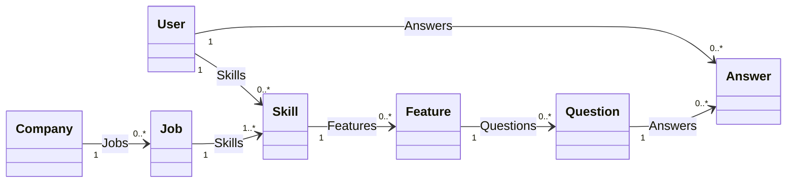

SkillMatch

```mermaid
classDiagram
  direction LR

  User "1" --> "0..*" Skill : Skills
  User "1" --> "0..*" Answer : Answers
  Company "1" --> "0..*" Job : Jobs
  Skill "1" --> "0..*" Feature : Features
  Feature "1" --> "0..*" Question : Questions
  Question "1" --> "0..*" Answer : Answers
  Job "1" --> "1..*" Skill : Skills
```